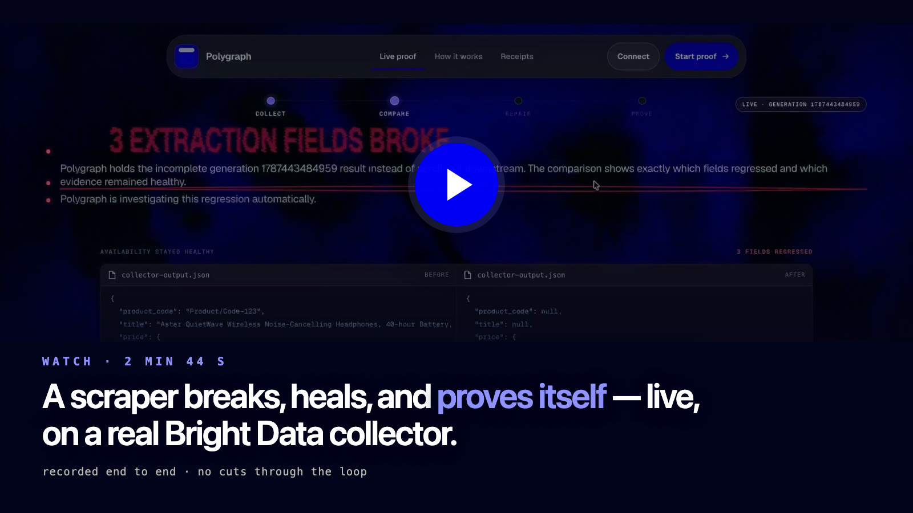
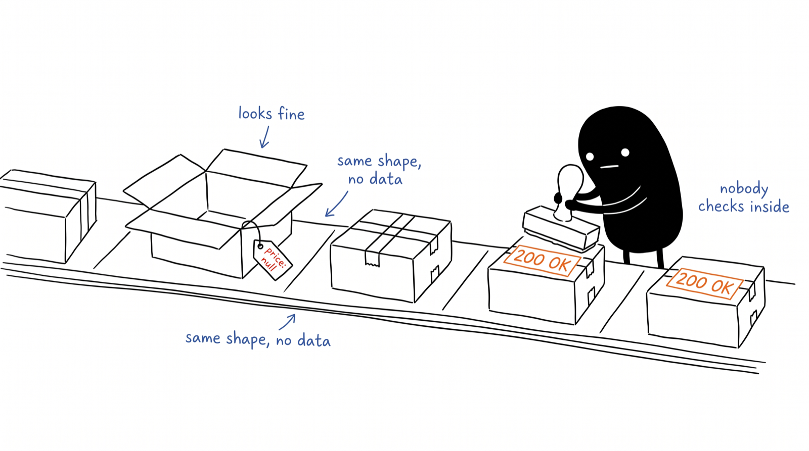
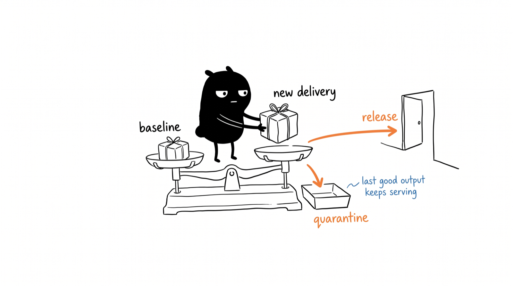
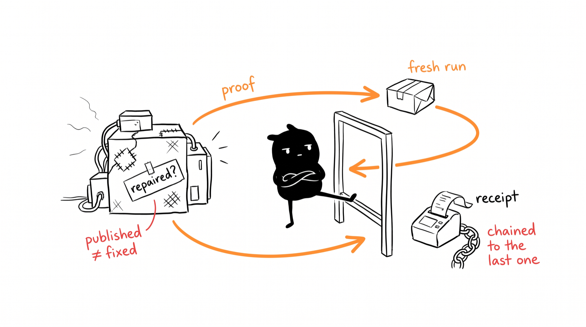

<div align="center">

# Polygraph

**Your scraper says 200 OK. Polygraph says whether it's telling the truth — and fixes it when it isn't.**

[](https://youtu.be/RCm3qeIegj0)
[](https://35.193.31.253.sslip.io)
[](https://github.com/Jayanthkoppala/polygraph/actions/workflows/ci.yml)
[](https://nodejs.org)
[](https://www.typescriptlang.org)
[](https://brightdata.com)
[](LICENSE)

<a href="https://youtu.be/RCm3qeIegj0">
  
</a>

**[▶ Watch the 2 min 44 s walkthrough](https://youtu.be/RCm3qeIegj0)**  ·  **[Try it live, no signup](https://35.193.31.253.sslip.io/live-proof)**

<br>

<a href="https://35.193.31.253.sslip.io/how-it-works">
  
</a>

<sub><a href="https://35.193.31.253.sslip.io/how-it-works">Interactive version</a> · <a href="https://35.193.31.253.sslip.io/app">Open the product</a> · <a href="https://35.193.31.253.sslip.io/receipts">Live receipts</a> · <a href="docs/evidence/production-canary-2026-08-23.md">Production evidence</a></sub>

</div>

---

## The problem



Scrapers fail by succeeding. The request goes through, the JSON parses, the job reports
success — and the `price` field has quietly become `null`. Status monitoring watches HTTP
codes. It cannot tell you whether the *data* is right, and the site that changed its markup
is not going to announce it.

## What Polygraph does



It sits behind a [Bright Data](https://brightdata.com) collector and grades every delivery
the moment the webhook lands — against the last delivery known to be good, not a status
code. A match is released. A mismatch is quarantined, the last good output keeps serving,
and an incident opens.



When the break is fixable, Polygraph repairs the collector through Bright Data's own
Self-Healing with no human in the loop — then refuses to believe the repair until one fresh
production run passes the same checks. Every step is written to an append-only, hash-chained
ledger and summarised as a **repair receipt** with a timestamped timeline.

> **See it for yourself.** Press *Start proof* at **[35.193.31.253.sslip.io/live-proof](https://35.193.31.253.sslip.io/live-proof)** —
> no signup, no key — and watch a real Bright Data collector break and repair itself against a live store
> we host. Or [**watch the 2:44 walkthrough**](https://youtu.be/RCm3qeIegj0) first.

## How it works

1. **Baseline.** The collector's declared schema sets the contract; the first healthy
   delivery (≥ 5 rows) sets fill-rate expectations and yields an encrypted, reusable run input.
2. **Checks, every delivery, deterministic.** Shape, identity, coherence. Error records are
   partitioned; block/captcha codes hold the collector. Nothing here is AI.
3. **Repair prompt → Bright Data Self-Healing.** Composed from the evidence. A gate that
   reports `success: false` is never approved; the preview must show the regressed fields back.
4. **Publish with `auto_save`.** Publishing is not recovery.
5. **Proof gate.** One fresh run on the published template, graded in-process: every regressed
   field restored, no retained field damaged, same entity. Only then: new baseline, receipt,
   `RECOVERY_VERIFIED` — in one transaction.
6. **Memory.** Receipts are insert-only and survive collector removal and tenant deletion.

Budgets (2 attempts per incident, 30-minute cooldown, 10 heals a day), lease-based worker,
crash-safe resume, the 16 held-reason codes, and the full state machines are in
[`docs/recovery.md`](docs/recovery.md). The Gemini advisor in `src/ai/` powers the
`/live-proof` demo mission; the hosted loop is plain code.

## Proven

On 2026-08-23 a live collector delivered a healthy baseline, then a delivery with `points`
removed. Polygraph quarantined it, repaired it through Self-Healing, published template
`….2`, verified it with a fresh 31-row run and wrote receipt `985f5e71…` as ledger #67.
Detected → verified: **16 min 22 s**, nobody involved.
[Screenshots and ids](docs/evidence/production-canary-2026-08-23.md) ·
[`auto_save` experiment, 13/13](docs/evidence/autosave-proof-2026-08-23.md) ·
[what we got wrong first](docs/FINDING-heal-promotion.md)

Every repair since then is public at **[35.193.31.253.sslip.io/receipts](https://35.193.31.253.sslip.io/receipts)** — and the whole loop is on film: [**▶ 2:44 walkthrough**](https://youtu.be/RCm3qeIegj0).

## Run it

**Nothing to install:** the hosted instance is at **[35.193.31.253.sslip.io](https://35.193.31.253.sslip.io)** — [live proof](https://35.193.31.253.sslip.io/live-proof),
[how it works](https://35.193.31.253.sslip.io/how-it-works), [receipts](https://35.193.31.253.sslip.io/receipts). To run your own:

Node 22. `better-sqlite3` is native — `npm rebuild better-sqlite3` after switching Node.

```bash
git clone https://github.com/Jayanthkoppala/polygraph.git && cd polygraph
npm run setup                                   # server + app deps

npm --prefix app run build && npm run demo      # offline, no key, dashboard on :4141

POLYGRAPH_MASTER_KEY="$(openssl rand -base64 32)" npm run local   # hosted product on :8080
```

All commands, scripts and environment variables: [`docs/cli.md`](docs/cli.md) ·
[`.env.example`](.env.example). Deploying and operating the single-VM production instance:
[`deploy/README.md`](deploy/README.md).

## Stack

| | |
|---|---|
| Server | Node 22, TypeScript, `commander`. One process: API, static app, recovery worker, scheduler |
| Storage | SQLite (`better-sqlite3`, WAL). Hash-chained ledger, insert-only receipts, 19 idempotent migrations |
| Provider | Bright Data Scraper Studio — runs, webhooks, Self-Healing, `auto_save`. One client, `src/brightdata/` |
| Front end | React 19, Vite, Tailwind v4 — `/app`, `/receipts`, `/how-it-works`, `/live-proof` |
| Agents | MCP server: `fleet_status`, `ledger_verify`, `get_safe_output`, `run_verification` |
| Tests | Vitest, 124 files / ~1,500 tests, backend against a real server and database. CI: typecheck, test, build, Docker |

## Layout

```
src/index.ts, src/mcp.ts   entry points
src/cli/                   one module per command
src/evidence/              checks, adapters, extractors
src/brightdata/            the only Bright Data client
src/loop/  src/store/      runner + governor; ledger + safe output
src/tenancy/               tenants, auth, key custody, scheduler, migrations
  recovery/                policy, worker, provider adapter, stores, API
app/                       React front end (tests in app/tests)
scripts/test/              backend suite, mirroring src/
deploy/  docs/             VM contract; reference, evidence, findings
```

## Status

| | |
|---|---|
| Checks, ledger, Bright Data integration, autonomous repair loop, receipts | Done, proven live |
| Multi-tenancy, key custody, workspace, Telegram, remove collector | Live |
| Gemini advisor in the hosted loop | Not wired (demo only) |
| Staging VM | Blocked on GCP billing |
| npm publish, peer corroboration, drift detection | Not yet |

Watch: [**2:44 walkthrough**](https://youtu.be/RCm3qeIegj0) · Try: [**live instance**](https://35.193.31.253.sslip.io) · Proof: [**receipts**](https://35.193.31.253.sslip.io/receipts)

Details and the honest gaps: [`CHANGELOG.md`](CHANGELOG.md) · [`SECURITY.md`](SECURITY.md) ·
[`CONTRIBUTING.md`](CONTRIBUTING.md) · [`docs/AI-ASSISTANCE.md`](docs/AI-ASSISTANCE.md)

## Author

**Jayanth Koppala** — [site](https://jayanthkoppala.vercel.app) · [X](https://x.com/JayBosshq) ·
[LinkedIn](https://www.linkedin.com/in/jayanth-koppala-71a8091b9/) · jay@bosshq.in

MIT — see [`LICENSE`](LICENSE).
