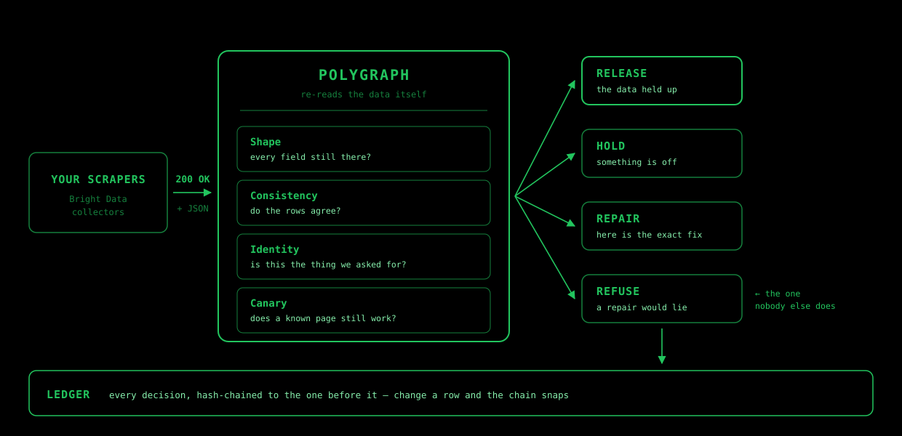

# Polygraph

**Your scraper says 200 OK. Polygraph says whether it's telling the truth.**

Scrapers fail by succeeding. The request goes through, the JSON parses, the job reports
success — and the price field has quietly collapsed to zero, or the whole response is for
the wrong product. Status monitoring watches HTTP codes and job states. It cannot tell you
whether the data is *right*.

Polygraph re-reads the data itself, decides what happens to it, and writes down why.



---

## What it actually does

A scrape comes back. Polygraph runs four checks against the data, not the status code:

| Check | The question it asks |
|---|---|
| **Shape** | Is every field still there, or did one collapse to its default? |
| **Consistency** | Do the rows agree with each other? |
| **Identity** | Is this the thing we asked for, or a different page entirely? |
| **Canary** | Does a page we already know the answer for still come back correct? |

Then it decides — and the decision is the product:

- **Release** — the data held up. It goes through.
- **Hold** — something is off. A human looks before it reaches your database.
- **Repair** — a field broke in a fixable way. Here is the exact command to fix it.
- **Refuse** — the scraper fetched the *wrong thing*. A repair here would teach the
  scraper to be confidently wrong, so Polygraph refuses to offer one and tells you why.

Polygraph takes a deliberately cautious position: healing a wrong-target failure can be
worse than leaving it broken, because a repaired scraper that fetches the wrong page still
returns 200 OK — and now nobody is looking.

**Polygraph does not auto-heal customer collectors. It decides when healing is safe.**
The only unattended repair path in this repository is the disposable,
repository-owned hackathon fixture described below; it has a separate exact
collector/URL allowlist and a process-lifetime paid-run cap.

---

## Every decision leaves a receipt

Verdicts land in an append-only ledger, each entry hashed together with the one before it.
Change any row and the chain snaps at that row and every row after it. `ledger verify` walks
the chain and tells you where it broke.

This matters because "the data was wrong for six days" is an argument, and an argument needs
evidence. The ledger is the evidence.

---

## We caught a repair lying, too

Running this against a live vendor self-heal on 2026-08-20 turned up something worth
reporting:

The heal reported `status: "done"` in about 105 seconds, with the approval step completed.
The change landed in a **draft**. The collector's production schema was unchanged, and we
found no API endpoint that promotes a draft to production. So the run reported success and
production stayed exactly as broken as it was.

Which is the same failure Polygraph exists to catch, one level up.

Polygraph currently detects this by snapshotting the collector's declared fields before and
after a repair and refusing to call it a recovery when they are identical. **That check is a
weak proxy and we know it**: a price selector can be repaired perfectly while the output
schema stays `{sku, title, price, stock}`, so schema equality is the expected result, not
evidence of a failed promotion. The replacement is behavioural proof from a fresh production
run. Full write-up: [`docs/FINDING-heal-promotion.md`](docs/FINDING-heal-promotion.md).

---

## Run it yourself

No account, no API key, no network. The demo runs offline against a local fixture.

**Node 22 or newer is required** — `better-sqlite3` is a native module and older runtimes
fail with a confusing ABI error rather than a clear one.

```bash
git clone https://github.com/Jayanthkoppala/polygraph.git && cd polygraph
npm install && npm run demo
```

You'll watch a healthy fleet pass, a price field die and get quarantined with a suggested
repair, a scraper fetch the wrong product and have its repair **refused**, and finally
`ledger verify` confirming the chain is intact.

## The hosted server

One instance is live on a Google Cloud VM behind Caddy:

```bash
npm run build:all
POLYGRAPH_MASTER_KEY=<32-byte hex> npm run serve
```

### One local product URL

For local hosted-product work, use one command and one URL:

```bash
POLYGRAPH_MASTER_KEY=<32-byte hex> npm run local
```

Open **http://127.0.0.1:8080**. This command first checks whether another process
already owns port 8080, builds the React app, then serves the app and tenant API
from the same hosted server. It deliberately refuses to start a second copy.

`app/npm run dev` is optional frontend-only work on fixed port 5174; it proxies API
calls to 8080 and exits when 5174 is already in use. It is not the supported local
product URL. The legacy `watch`, demo, and fixture commands are separate tools and
must not be used to judge the hosted product.

Each account connects its own Bright Data key and gets its own collectors, schedule, and
ledger chain starting from its own genesis hash. See [`deploy/README.md`](deploy/README.md)
for the environment contract and why exactly one instance may ever run.

**On key custody**, because you should ask before pasting an API key anywhere: keys are
encrypted per tenant with AES-256-GCM, and the key that decrypts them lives in the server
environment, never in the database — stealing the database file yields ciphertext and
nothing else. No endpoint returns a key back to you. The server never spends your Bright
Data credits: auto-repair is structurally disabled in the hosted path.

## Use it from a coding agent

A local MCP server exposes four narrow tools: fleet status, ledger verification, last
verified output, and an explicit one-collector verification run.

```bash
npm run build
codex mcp add polygraph --env POLYGRAPH_CONFIG=$PWD/fleet.yaml -- node $PWD/dist/index.js mcp
```

MCP can never auto-heal. Network-backed runs are off by default and need both a server
opt-in and per-call confirmation. See [`docs/MCP.md`](docs/MCP.md).

---

## Layout

Flat files at `src/` root are entry points. Everything else is a folder named for what it
does, and every test sits at the mirror path of the file it covers.

```
src/index.ts       CLI entry — builds the program, registers commands
src/mcp.ts         coding-agent tool surface
src/cli/           one module per command
src/core/          types, config, error classification
src/evidence/      the four checks, adapters, extractors
src/brightdata/    the only outbound Bright Data client, plus heal
src/loop/          runner, policy governor, alerts
src/store/         hash-chained ledger, safe-output retention
src/http/          the offline dashboard server
src/tenancy/       multi-tenant isolation, auth, key custody, scheduler
src/fixture/       the local break lab
src/demo/          the live V1→V2 mission
app/               React front end — landing, sandbox, onboarding, fleet
scripts/test/      backend suite, mirroring src/
deploy/            how the live instance runs
docs/              architecture, design specs, the heal-promotion finding
```

## Commands

```bash
npm run demo          # offline story, no account needed
npm test              # backend suite
npm run test:all      # backend + front end
npm run typecheck:all # both halves
npm run build:all     # compile server + front end
```

---

## Where this actually is

Stated plainly, because a verification tool that overstates its own progress is
self-defeating:

| Piece | State | What that means |
|---|---|---|
| Verdict engine — four checks, classifier, policy | **Done** | Tested, drives both paths |
| Hash-chained ledger + `ledger verify` | **Done** | Per-account chains, tamper-evident |
| Bright Data integration | **Done** | Proven against a live collector, not mocks |
| Offline demo | **Done** | `npm run demo`, no account, no network |
| Multi-tenancy — isolation, key custody, onboarding | **Live** | One instance running, auth enforced |
| Dashboard — fleet view, evidence, ledger stream | **Built, polishing** | Density and keyboard nav unfinished |
| Front end / landing page | **Built** | V1→V2 mission, real event tracker, legal routes |
| Published to npm | **Not yet** | Configured as `polygraph-data`, unpublished |
| Peer corroboration between collectors | **Not wired** | Needs 3+ same-purpose collectors to say anything |
| Drift / trend detection | **Not built** | No trend signal exists; a chart drawn from nothing would be a lie |
| Automated rollback | **Not built** | No supported API found — recovery is the documented Versions UI |

- **Customer auto-repair is off in the hosted path**, structurally, not as a default. Only
  the repository-owned fixture can mint the separate demo permit, and it carries its own
  collector/URL allowlist and a process-lifetime paid-run cap.
- **The landing mission never fabricates success.** It renders only server events and
  visibly falls back when the mission API is unavailable.

---

## Author

Built by **Jayanth Koppala**.

MIT licensed — see [`LICENSE`](LICENSE). Use it, fork it, run it against your own fleet.
